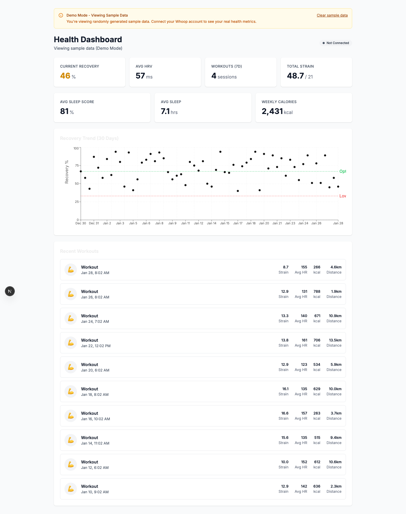

# Rdy Vigil

Careful monitoring of your recovery, sleep, and workouts. A modern health metrics dashboard that integrates with Whoop. Built with Next.js 16, Supabase, and a custom dark-themed design system.



## Features

- **Recovery Tracking** - Monitor your daily recovery score, HRV, and resting heart rate with color-coded indicators
- **Workout Analytics** - View workout history with strain scores, heart rate data, and calories burned
- **Sleep Insights** - Track sleep duration, efficiency, and sleep stages
- **30-Day Trends** - Interactive charts showing your recovery patterns over time
- **Responsive Layout** - Auto-detecting mobile/desktop layout with manual toggle
- **Demo Mode** - Try the app with realistic sample data before connecting your Whoop
- **Real-time Sync** - Automatic data synchronization with your Whoop account
- **Secure Authentication** - Email/password auth with magic link support via Supabase

## Design System

The app features a professional dark theme with a comprehensive design token system:

| Token Category | Examples |
|----------------|----------|
| **Backgrounds** | `--bg-page` (#0A0A0B), `--bg-surface` (#111113), `--bg-elevated` (#1A1A1D) |
| **Text** | `--text-primary` (white), `--text-secondary`, `--text-muted` |
| **Accents** | `--accent` (#10B981 emerald), `--accent-blue`, `--warning`, `--error` |
| **Recovery** | `--recovery-high` (green), `--recovery-medium` (yellow), `--recovery-low` (red) |

### Typography

- **Display**: Instrument Serif - elegant headings
- **Body**: Inter - clean, readable text
- **Mono**: DM Mono - metrics and data values
- **Icons**: Lucide icon font

## Tech Stack

| Technology | Purpose |
|------------|---------|
| [Next.js 16](https://nextjs.org/) | React framework with App Router |
| [React 19](https://react.dev/) | UI library |
| [Supabase](https://supabase.com/) | Auth, database, and real-time subscriptions |
| [Tailwind CSS 4](https://tailwindcss.com/) | Utility-first styling with CSS variables |
| [Zustand](https://zustand-demo.pmnd.rs/) | Client-side state management |
| [Recharts](https://recharts.org/) | Data visualization |
| [TypeScript](https://www.typescriptlang.org/) | Type safety |

## Architecture

```
┌─────────────────┐     ┌──────────────────┐     ┌─────────────────┐
│   Next.js App   │────▶│    Supabase      │◀────│   Whoop API     │
│   (Frontend)    │     │  (Auth + DB)     │     │   (Webhooks)    │
└─────────────────┘     └──────────────────┘     └─────────────────┘
        │                        │
        ▼                        ▼
┌─────────────────┐     ┌──────────────────┐
│  Server Actions │     │   Row Level      │
│  & API Routes   │     │   Security       │
└─────────────────┘     └──────────────────┘
```

### Key Components

- **Server Components** - Data fetching happens on the server with React cache for deduplication
- **Row Level Security (RLS)** - Users can only access their own health data
- **OAuth Integration** - Secure token storage with encryption for Whoop API
- **Webhook Handlers** - Real-time data updates from Whoop
- **Responsive Layout** - Auto-detecting mobile/desktop with Zustand persistence

## Screenshots

### Landing Page
Dark-themed landing page with hero section, dashboard preview, and feature highlights.

### Dashboard
Full-width dashboard with sidebar navigation (desktop) or bottom tab bar (mobile), stat cards showing recovery/HRV/strain/sleep metrics, recovery trend chart, and recent workouts list.

### Authentication
Split-panel auth pages with form on left and visual marketing content on right. Login uses green accent gradient, signup uses purple.

## Getting Started

### Prerequisites

- Node.js 18+
- A Supabase project
- (Optional) Whoop developer account for API integration

### 1. Clone and Install

```bash
git clone https://github.com/tanglefast23/rdy-vigil.git
cd rdy-vigil
npm install
```

### 2. Configure Environment

Copy the example environment file:

```bash
cp .env.local.example .env.local
```

Fill in your Supabase credentials:

```env
# Supabase (required)
NEXT_PUBLIC_SUPABASE_URL=your_supabase_url
NEXT_PUBLIC_SUPABASE_ANON_KEY=your_anon_key
SUPABASE_SERVICE_ROLE_KEY=your_service_role_key

# Whoop OAuth (optional - for real data)
WHOOP_CLIENT_ID=your_whoop_client_id
WHOOP_CLIENT_SECRET=your_whoop_client_secret

# Security
ENCRYPTION_KEY=generate_a_32_byte_hex_key
CRON_SECRET=generate_a_random_secret
```

### 3. Set Up Database

Run the database migration in your Supabase SQL editor:

```bash
# Copy contents of supabase/migrations/001_health_tracker_schema.sql
# and run it in Supabase Dashboard > SQL Editor
```

### 4. Run Development Server

```bash
npm run dev
```

Open [http://localhost:3000](http://localhost:3000) to see the app.

## Demo Mode

Don't have a Whoop account? No problem! The app includes a demo mode with realistic sample data.

1. Create an account or log in
2. On the empty dashboard, click **"Load Sample Data (Demo Mode)"**
3. Explore the dashboard with 30 days of generated health data
4. Clear the data anytime with **"Clear sample data"** in the banner

Demo data includes:
- Recovery scores with HRV and resting heart rate
- 15 workout sessions of various types
- 30 days of sleep tracking data

## UI Components

The app includes a reusable component library in `/src/components/`:

| Component | Description |
|-----------|-------------|
| `Button` | Primary (gradient), Secondary (dark), Ghost variants |
| `Input` | Labeled input field with optional icon |
| `Logo` | Rdy Vigil brand mark with eye icon and split-color text |
| `NavItem` | Sidebar navigation item with active states |
| `StatCard` | Metric display with label, value, trend indicator |
| `FeatureCard` | Feature showcase with icon, title, description |
| `WorkoutCard` | Workout row with activity, strain, HR, calories |

### Layout Components

| Component | Description |
|-----------|-------------|
| `DashboardLayout` | Coordinates responsive sidebar, header, content |
| `ResponsiveSidebar` | Fixed sidebar (desktop) / slide-in drawer (mobile) |
| `DashboardHeader` | Sticky header with hamburger menu and layout toggle |
| `MobileTabBar` | Bottom navigation for mobile view |
| `LayoutModeToggle` | Auto/Mobile/Desktop view switcher |

## Database Schema

The app uses these Supabase tables:

| Table | Description |
|-------|-------------|
| `health_oauth_connections` | OAuth tokens for Whoop integration |
| `health_metrics` | Time-series health measurements |
| `health_workouts` | Workout/activity sessions |
| `health_sleep` | Sleep session data |
| `health_recovery` | Daily recovery scores |
| `health_sync_status` | Sync tracking per provider |

All tables have Row Level Security enabled - users can only see their own data.

## Project Structure

```
src/
├── app/
│   ├── api/
│   │   ├── auth/whoop/          # Whoop OAuth flow
│   │   ├── cron/sync-worker/    # Background sync job
│   │   ├── seed-test-data/      # Demo data seeding
│   │   └── webhooks/whoop/      # Whoop webhook handler
│   ├── dashboard/
│   │   ├── components/          # Dashboard-specific components
│   │   ├── layout.tsx           # Shared dashboard layout
│   │   ├── page.tsx             # Main dashboard
│   │   ├── workouts/            # Workouts page
│   │   ├── sleep/               # Sleep page
│   │   └── recovery/            # Recovery page
│   ├── settings/                # Settings page
│   ├── login/                   # Login page
│   ├── signup/                  # Signup page
│   ├── globals.css              # Design tokens & base styles
│   └── layout.tsx               # Root layout with fonts
├── components/
│   ├── layout/                  # Responsive layout components
│   │   ├── DashboardLayout.tsx
│   │   ├── ResponsiveSidebar.tsx
│   │   ├── DashboardHeader.tsx
│   │   ├── MobileTabBar.tsx
│   │   └── LayoutModeToggle.tsx
│   └── ...                      # Shared UI components
├── hooks/
│   ├── useLayoutMode.ts         # Responsive layout hook
│   ├── useIsMounted.ts          # SSR-safe mounting
│   └── useRealtimeSync.ts       # Real-time sync status
├── stores/
│   └── layoutStore.ts           # Zustand store for layout
├── lib/
│   ├── supabase/                # Supabase clients
│   ├── whoop/                   # Whoop API client
│   ├── crypto.ts                # Token encryption
│   └── data.ts                  # Data fetching utilities
└── types/
    └── health.ts                # TypeScript types
```

## Deployment

### Vercel (Recommended)

1. Push your code to GitHub
2. Import the project in [Vercel](https://vercel.com)
3. Add environment variables in Vercel dashboard
4. Deploy!

**Live Demo**: [rdy-vigil.vercel.app](https://rdy-vigil.vercel.app)

### Environment Variables for Production

Make sure to set all environment variables in your Vercel project settings:
- `NEXT_PUBLIC_SUPABASE_URL`
- `NEXT_PUBLIC_SUPABASE_ANON_KEY`
- `SUPABASE_SERVICE_ROLE_KEY`
- `WHOOP_CLIENT_ID` (if using Whoop)
- `WHOOP_CLIENT_SECRET` (if using Whoop)
- `ENCRYPTION_KEY`
- `CRON_SECRET`

## Whoop Integration

To connect real Whoop data:

1. Create a Whoop developer account at [developer.whoop.com](https://developer.whoop.com)
2. Register your application
3. Add your Client ID and Secret to environment variables
4. Configure the callback URL: `https://your-domain.com/api/auth/whoop/callback`
5. Users can then connect their Whoop from the dashboard sidebar

## Contributing

Contributions are welcome! Please open an issue or submit a pull request.

## License

MIT License - feel free to use this project for your own health tracking needs.
